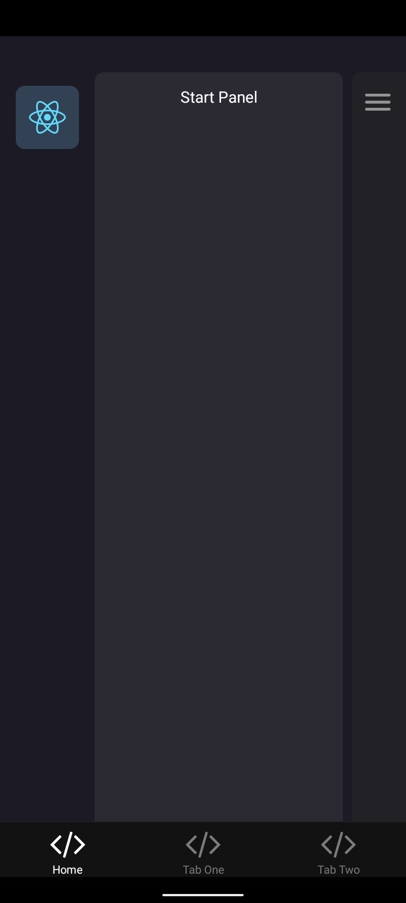
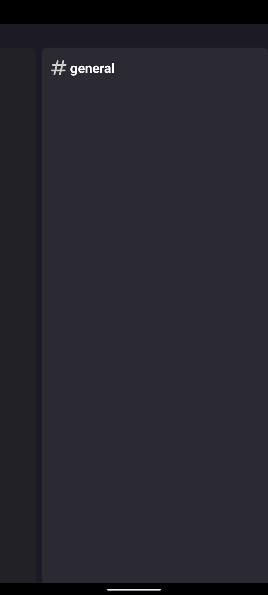

# DiscordCloneUI

## Table of Content:

- [About The App](#about-the-app)
- [Screenshots](#screenshots)
- [Technologies](#technologies)
- [Setup](#setup)

## About The App

<a href="https://github.com/kennethliad1017/DiscordCloneUI">DiscordCloneUI</a> is a **Project** that aims to clone the **Discord Drawer Navigation and Modal** to improve my **Skills**.

## Screenshots

Left Drawer Screen| Main Screen |Right Drawer Screen|
:-------------------------:|:-------------------------:|:-------------------------:
 |
 |

## Technologies

- [React Native (Expo)](https://docs.expo.dev/get-started/installation/)
- [React Native Reanimated](https://docs.swmansion.com/react-native-reanimated/docs/)
- [React Native Gesture Handler](https://docs.swmansion.com/react-native-gesture-handler/docs/)

## Installation
1. Clone the Repository
```sh
git clone https://github.com/kennethliad1017/DiscordCloneUI.git
```

2. Install Packages
```sh
yarn install or npm install
```
3. Run
```sh
yarn start or npm run start
```
