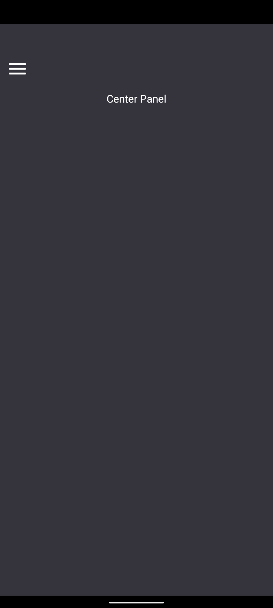

# DiscordCloneUI

## Table of Content:

- [About The App](#about-the-app)
- [Screenshots](#screenshots)
- [Technologies](#technologies)
- [Setup](#setup)

## About The App

[Discord Clone] is an app that recreates the [OverlappingPanels](https://github.com/discord/OverlappingPanels) using react-native-reanimated and react-native-gesture-handler.

## Screenshots





## Technologies

- [React Native (Expo)](https://docs.expo.dev/get-started/installation/)
- [React Native Reanimated](https://docs.swmansion.com/react-native-reanimated/docs/)
- [React Native Gesture Handler](https://docs.swmansion.com/react-native-gesture-handler/docs/)

## Setup

- download or clone the repository
- run one of the following:

  - ```shell
    npm install
    ```

  - ```shell
    yarn install
    ```

  - ```shell
    pnpm install
    ```

- testing on device or emulator run one of the following:

  - ```shell
    npm run start
    ```

  - ```shell
    yarn start
    ```

  - ```shell
    pnpm run start
    ```
